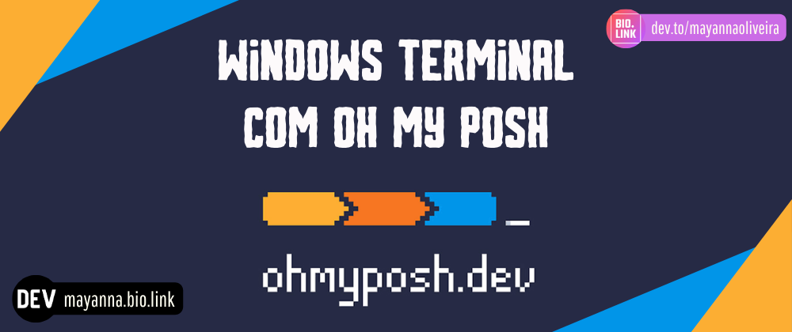

# Terminal do Windows com Oh My Posh

<<<<<<< .mine


=======


>>>>>>> .theirs
<!-- Hashtags: #ohmyposh #terminal #windows-->

<!-- Lista de Badges -->
[![Documentation][docs-badge]][docs]  [![PoshGit][PG-badge]][PoshGit] [![winget][winget-badge]][winget-site] [![PSReadLine][PSR-badge]][PSReadLine] [![Terminal-Icons][TI-badge]][Terminal-Icons] [![Dracula][DT-badge]][Dracula] [![Nerd-Fonts][NF-badge]][Nerd-Fonts]

#### Conteúdo

- [Requisitos](#requisitos)
- [Instalação do Winget](#instalação-do-winget)
- [Tema Dracula](#tema-dracula)
- [Instalação do Oh My Posh](#instalação-do-oh-my-posh) 
- [Oh My Posh e o Antivírus](#oh-my-posh-e-o-antivírus) 
- [Posh Git e Oh My Posh](#posh-git-e-oh-my-posh)
- [Alterar o Tema](#alterar-o-tema)
- [Instalação do PSReadLine](#instalação-do-psread-line)
- [Manipulando Segmentos](#manipulando-segmentos)
- [Instalação do Terminal Icons](#instalação-do-terminal-icons)
- [Navegação com PSReadLine](#navegação-com-psreadline)
- [Alterando as Cores](#alterando-as-cores)
- [Corrigindo Fonts no Terminal](#corrigindo-fonts-no-terminal)
- [Tema Personalizado](#tema-personalizado)
- [Terminal no Visual Studio Code](#terminal-no-visual-studio-code)
- [Anexo](#anexo)

---

### Requisitos

Antes de iniciar a instalação é necessário configurar os pré-requisitos:
1. Instalação do Winget via [Microsoft Store](https://apps.microsoft.com/).
2. Baixar do [Nerds Fonts](https://www.nerdfonts.com) as fontes MesloLGM, Fira Code Mono e Jet Brains Fonts Mono.
3. Acessar a documentação do [Oh My Posh](https://ohmyposh.dev/docs/installation/windows) e seguir o passo-a-passo.
4. Lista de [temas](https://ohmyposh.dev/docs/themes) do Oh My Posh.
5. Pode usar no Windows Terminal o tema [Dracula](https://draculatheme.com/) ou customizar um de sua preferência.

---

## Instalação do Winget

Toda a instalação no Oh My Posh é realizada via terminal utilizando o [Winget](https://apps.microsoft.com/detail/9NBLGGH4NNS1?hl=pt-br&gl=US) para a instalação do pacote.
Apenas acesse a Microsoft Store diretamente da sua máquina, busque por Winget e clique em instalar.


---

## Tema Dracula

A instalação do tema [Dracula](https://draculatheme.com/windows-terminal) no Windowns Terminal é bem simples.
1. Clique no terminal com o botão direito do mouse e vá em `Configurações`.
2. Dentro das configurações acesse a opção `Abrir com JSON`.


3. Insira dentro do bloco Schemes o [tema do Dracula](https://draculatheme.com/windows-terminal).


- Código do tema do Dracula: 
```json
"schemes": [
    {
        "name": "Dracula",
        "cursorColor": "#F8F8F2",
        "selectionBackground": "#44475A",
        "background": "#282A36",
        "foreground": "#F8F8F2",
        "black": "#21222C",
        "blue": "#BD93F9",
        "cyan": "#8BE9FD",
        "green": "#50FA7B",
        "purple": "#FF79C6",
        "red": "#FF5555",
        "white": "#F8F8F2",
        "yellow": "#F1FA8C",
        "brightBlack": "#6272A4",
        "brightBlue": "#D6ACFF",
        "brightCyan": "#A4FFFF",
        "brightGreen": "#69FF94",
        "brightPurple": "#FF92DF",
        "brightRed": "#FF6E6E",
        "brightWhite": "#FFFFFF",
        "brightYellow": "#FFFFA5"
    }
]

```
- A partir do exemplo acima é possível também criar o seu próprio tema com suas cores favorias.
4. Para alterar o tema do Windows Terminal acesse novamente as `Configurações` > `Esquema de Cores`, selecione `Dracula` e salve.
 


5. Caso o passo 4 não funcione acesse `Configurações` > `PoweShell` > `Aparência` > `Esquema de Cores`, selecione `Dracula` e salve.


6. Aproveite que está no passo 5 e troque o `Tipo de Fonte` para `FireCore Nerd Font` e salve.

---

## Instalação do Oh My Posh

Toda a instalação é feita via terminal graças ao Winget, siga o passos abaixo:

1. Ter o Winget devidamente instalado.
2. Instalar as fonts do Nerd Fonts.
3. 
4. Acessar o Power Shell e digitar `winget install JanDeDobbeleer.OhMyPosh -s winget`.
5. Instalar o temas
6. Efetuar a instalação com o comando `winget install JanDeDobbeleer.OhMyPosh -s winget`.
7. Insira o comando `winget upgrade JanDeDobbeleer.OhMyPosh -s winget` para verificar se tem atualização.
8. Configure o tema usando o comando `oh-my-posh init pwsh --config "$env:POSH_THEMES_PATH\jandedobbeleer.omp.json"`. o terminal vai retornar um outro comando `(@(& 'C:/Users/Dev/AppData/Local/Programs/oh-my-posh/bin/oh-my-posh.exe' init pwsh --config='C:\Users\Dev\AppData\Local\Programs\oh-my-posh\themes\jandedobbeleer.omp.json' --print) -join "`n") | Invoke-Expression` então use ele novamente como mostra abaixo:
9. Após a instalação rode o comando `notepad $PROFILE` para configurar o perfil e insira as linhas:

```powershell
import-Module oh-my-posh
Set-PoshPrompt -Theme JanDeDobbeleer
```
10. `JanDeDobbeleer` é o nome do tema para conhecer mais acesse is [temas](https://ohmyposh.dev/docs/themes) no site ou acessar o [repositório do Oh My Posh no GitHutb](https://github.com/JanDeDobbeleer/oh-my-posh).

---

## Oh My Posh e o Antivírus

O Oh My Posh passa por atualizações frequentes por isso, o antivírus pode ocasionalmente o sinaliza (falso positivo) então, acesse o seu antivírus e libere a execução do Oh My Posh. Para localizar o executável utilize o comando `(Get-Command oh-my-posh).Source`.

---

# Posh Git e Oh My Posh

O Oh My Posh é um módulo do PowerShell que ajuda a decorar nossa janela do PowerShell usando diferentes temas integrados e personalizados.

O [Posh Git](https://github.com/dahlbyk/posh-git) é um módulo do PowerShell que integra Git e PowerShell, fornecendo informações resumidas de status do Git que podem ser exibidas no prompt do PowerShell, por exemplo, posh-git também fornece suporte para preenchimento de guias para comandos git comuns, nomes de ramificações, caminhos e muito mais.

Instale ambos através dos comandos `Install-Module posh-git -Scope CurrentUser` e logo após o comando `Install-Module oh-my-posh -Scope CurrentUser`.

---

## Alterar o Tema

Para verificar todos os temas disponíveis use o comando `Get-PoshThemes`. Caso queira alterar é só seguir os passos já abordados:
1. Acessar o terminal e usar o comando `notepad $PROFILE` ou `code $PROFILE`.
2. Trocar `JanDeDobbeleer` no código abaixo pelo tema que mais agrada.
```powershell
import-Module oh-my-posh
Set-PoshPrompt -Theme JanDeDobbeleer
```

---

## Instalação do PSReadLine

O [PSReadLine](https://github.com/PowerShell/PSReadLine) vai ajudar a otimizar a sua experiência no uso do terminal, a instalação é simples:

1. Digite no terminal o comando: `Install-Module PSReadLine -AllowPrerelease -Force`.
2. Use o `notepad $PROFILE` para acessar o perfil e inserir as linhas:

```powershell
if ($host.Name -eq 'ConsoleHost')
{
    Import-Module PSReadLine
}
```

---

## Manipulando Segmentos

O Oh My Posh tem alguns [seguimentos](https://ohmyposh.dev/docs/segments/git) que podem ser instalados conforme sua rotina de trabalho, abaixo veja o exemplo de um usuário de Git:

```json
{
	"type": "git",
	"style": "powerline",
	"powerline_symbol": "",
	"invert_powerline": false,
	"foreground": "#193549",
	"background": "#fffb38",
	"leading_diamond": "",
	"trailing_diamond": "",
	"properties": {
		"display_status": true,
		"display_stash_count": true,
		"display_upstream_icon": true
}
```
Os [segmentos](https://ohmyposh.dev/docs/configuration/segment) estão disponíveis no site do projeto e sao inseridos dentro do `block` conforme o exemplo abaixo:

```json
{
    "blocks": [
        {
            // positioning metadata (not shown)
            "segments": []
        }
    ]
}
```

---

## Instalação do Terminal Icons
Toda vez que listar um repositório com o comando `ls` será exibido os ícones dos arquivos conforme suas extensões, a instalação do [Terminal Icons](https://github.com/devblackops/Terminal-Icons) é bem simples e també feita via terminal.

1. Insira no terminal o comando `Install-Module -Name Terminal-Icons -Repository PSGallery`.
2. Após instalado os ícones acesse o perfil do terminal `notepad @=$PROFILE` e insira a linha `Import-Module -Name Terminal-Icons`.
3. Agora teste a instalação usando o comando `ls`.

---

## Navegação com PSReadLine

O [PSReadLine](https://github.com/PowerShell/PSReadLine) facilita a navegação poís tem um pacote de funções que ajudam o usuário a ter mais produtividade no uso do terminal, sua instalação é via terminao siga os passos:

1. Efetue a instalção com a linha de comando `Install-Module PSReadLine -AllowPrerelease -Force`.
2. Após instalado acesse o perfil do terminal `notepad @=$PROFILE`. 
3. Insira as linhas:
```powershell
Import-Module PSReadLine
Set-PSReadLineOption -PredictionSource History
Set-PSReadLineOption -PredictionViewStyle ListView
Set-PSReadLineOption -EditMode Windows
```
4. Agora digite notepad e perceba que o histórico do que foi digitado antes é exibido.

---

## Alterando as Cores

As [cores padrão](https://ohmyposh.dev/docs/configuration/colors) também podem ser alteradas conforme exemplo:
```json
{
  "type": "aws",
  "style": "powerline",
  "powerline_symbol": "\uE0B0",
  "foreground": "#ffffff",
  "background": "#111111",
  "foreground_templates": [
    "{{if contains \"default\" .Profile}}#FFA400{{end}}",
    "{{if contains \"jan\" .Profile}}#f1184c{{end}}"
  ]
}
```
---

## Corrigindo Fonts no Terminal

Caso o terminal não exiba das fonts é somente rodar o comando `oh-my-posh font install --user` e todas as fonts e icones irão aparece na linha de comando.
Caso continue aparecendo caracteres qubrados digite o comando `notepade $PROFILE` e insira a linha `oh-my-posh config migrate glyphs --write` veja o exemplo abaixo:

```powershell
import-Module oh-my-posh
Set-PoshPrompt -Theme JanDeDobbeleer
oh-my-posh config migrate glyphs --write
```
Essa foi a recomendação da própria documentação no link [After updating my Nerd Font to a newer version, the prompt displays unknown characters](https://ohmyposh.dev/docs/faq#after-updating-my-nerd-font-to-a-newer-version-the-prompt-displays-unknown-characters).

---

## Tema Personalizado

É possível também criar o seu próprio tema e personalizar sua linha do terminal como achar melhor. Como foi abordado nos tópicos anteriores, tem na documentação do Oh My Posh a lista de Segments, Colors entre outros. 

1. Utilize o tema padrão [JanDeDobbeleer](https://github.com/JanDeDobbeleer/oh-my-posh/blob/main/themes/jandedobbeleer.omp.json) como referência para as alterações.
2. Acesse o site do Oh My Posh > Menu > Docs > Segments e busque pelo segmento que deseja utilizar.
3. Copie o segmento e cole dentro do de `blocks` como mostra abaixo:

```json
{
  "$schema": "https://raw.githubusercontent.com/JanDeDobbeleer/oh-my-posh/main/themes/schema.json",
  ...
  "blocks": [
    {
      ...
      "segments": [
        {
          "type": "path",
          "style": "powerline",
          "powerline_symbol": "\uE0B0",
          "foreground": "#ffffff",
          "background": "#61AFEF",
          "template": " {{ .Path }}} ",
          "properties": {
            ...
          }
        }
      ]
    }
  ]
}
```
4. Salve o arquivo na pasta que deseja e depois insira no  perfil do Oh My Posh o diretório para esse arquivo customizado.
5. Digite no terminal `notepad $PROFILE`.
6. Insira a linha: `oh-my-posh --init --shell pwsh --config C:\Users\Dev\PowerShell\mytheme.omp.json | Invoke-Expression`

---

## Terminal no Visual Studio Code

Para exibir seu terminal no VS Code da mesma forma que no Windows Terminal basta aplicar duas alterações nas configurações.
1. Acesse: Menu > Settings.
2. Efetue a pesquisa de  `terminal.integrated.fontFamily` e insira a font `"MesloLGM Nerd Font"`.
3. Depois pesquise `terminal.integrated.fontSize` e insira o tamanho `12`.

---

#### Anexo
No fim o profile do Oh My Posh ficará conforme o exemplo em [anexo](./files/anexos.zip).

<!-- Badges -->
[PoshGit]: https://github.com/dahlbyk/posh-git
[PG-badge]: https://img.shields.io/badge/GitHub-Posh%20Git-181717.svg?style=flat&logo=GitHub&logoColor=white

[winget-badge]: https://img.shields.io/badge/Winget-0078D4.svg?style=flat&logo=Windows&logoColor=white
[winget-site]: https://winget.run/pkg/Microsoft/WindowsTerminal

[docs-badge]: https://img.shields.io/badge/Site-Oh%20My%20Posh-blue
[docs]: https://ohmyposh.dev

[PSReadLine]: https://github.com/PowerShell/PSReadLine
[PSR-badge]:  https://img.shields.io/badge/GitHub-PSReadLine-181717.svg?style=flat&logo=GitHub&logoColor=white

[Terminal-Icons]: https://github.com/devblackops/Terminal-Icons 
[TI-badge]: https://img.shields.io/badge/GitHub-Terminal%20Icons-181717.svg?style=flat&logo=GitHub&logoColor=white

[windows-terminal]: https://github.com/microsoft/terminal
[WT-badge]: https://img.shields.io/badge/Windows%20Terminal-4D4D4D.svg?style=flat&logo=Windows-Terminal&logoColor=white

[Nerd-Fonts]: https://github.com/ryanoasis/nerd-fonts
[NF-badge]:  https://img.shields.io/badge/GitHub-Nerd%20Fonts-181717.svg?style=flat&logo=GitHub&logoColor=white

[Dracula]: https://draculatheme.com/
[DT-badge]: https://img.shields.io/badge/Tema-Dracula-purple

